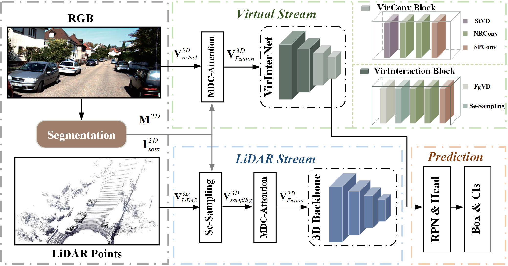
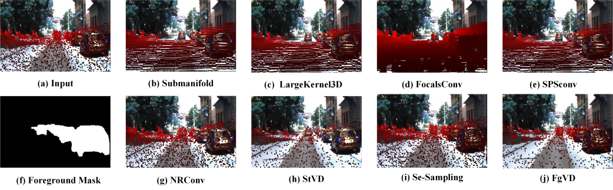
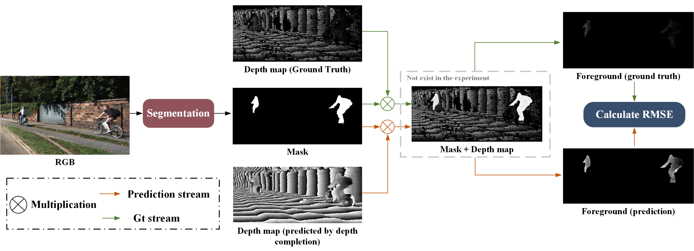

# VirInteraction: Enhancing Virutal-LiDAR Points Interaction by Using Image Semantics and Density Estimation for 3D Object Detection (RAL and IROS 2025)

This is the implementation of ***VirInteraction*** ,  a semantic-guided Virtual-LiDAR fusion method to enhance the interaction of virtual points and LiDAR points. This code is mainly based on [OpenPCDet](https://github.com/open-mmlab/OpenPCDet), some codes are from [VirConv](https://github.com/hailanyi/VirConv), [PENet](https://github.com/JUGGHM/PENet_ICRA2021), [mmsegmentation](https://github.com/open-mmlab/mmsegmentation/tree/main) and [PointConv](https://github.com/DylanWusee/pointconv).

## News
* [2024-12-19] The paper **"VirInteraction: Enhancing Virutal-LiDAR Points Interaction by Using Image Semantics and Density Estimation for 3D Object Detection"** has been accepted for RAL (URL: [VirInteraction](https://ieeexplore.ieee.org/document/10829633)) !
* [2024-12-31] The paper **VirInteraction** has been transfered to IROS 2025!
* [2025-01-09] The code of this paper is currently in the **beta version**, and its usability and readability are poor. Therefore, this code will be released after optimization.
* [2025-01-09] **How to test the detection accuracy at different distances** (Figure 7 of the paper) has been relased.4
* [2025-01-09] **How to generate virtual points** by using different depth incomplete methods (Table I of the paper) has been open source.
* [2025-01-09] **How to calculate foreground RMSE** (Table I of the paper) has been relased.

## Detection Framework

* VirInteraction: Enhancing Virutal-LiDAR Points Interaction by Using Image Semantics and Density Estimation for 3D Object Detection.

The detection frameworks are shown below.



### Experimental results

#### KITTI val dataset

| METHOD                                                        | EASY  | MOD   | HARD  |
| ------------------------------------------------------------- | ----- | ----- | ----- |
| [VirInteraction](tools/cfgs/models/kitti/VirInteraction.yaml) | 96.34 | 90.63 | 89.01 |

#### Visualization of voxel distribution of VirInteraction:



## Getting Started

### Prepare dataset

(1) dataset

Configure the data set file and path according to [Virconv](Virconv.md).

```
VirInteraction
├── data
│   ├── odometry
│   │   │── 00
│   │   │── 01
│   │   │   │── image_2
│   │   │   │── velodyne
│   │   │   │── calib.txt
│   │   │── ...
│   │   │── 21
│   ├── kitti
│   │   │── ImageSets
│   │   │── training
│   │   │   ├──calib & velodyne & label_2 & image_2 & (optional: planes)
│   │   │── testing
│   │   │   ├──calib & velodyne & image_2
├── pcdet
├── tools
```

(2) generate virtual points

PENet: You can generate PENet data sets from [Virconv](https://github.com/hailanyi/VirConv).

We have added additional completion methods to generate virtual points, which you can download and install by following the links provided. Finally, virtual points are generated according to the instructions provided under each method.

### Installation

(1)OpenPCDet

Please refer to [Virconv](https://github.com/hailanyi/VirConv) to set up libraries needed for distributed training and sparse convolution.

At the same time, you need to install our modified mmsegmentation.

(2)mmsegmentation

You need to follow the link to download the modified [mmsegmentation(ours)](https://pan.baidu.com/s/1XK4pPRe1LBsAjuknTF1wDQ?pwd=myrk).

### Training

You can run this code by calling the following command:

```
cd tools
python train.py --cfg_file cfgs/models/kitti/VirInteraction.yaml
```

### Test

You can run this code by calling the following command:

```
cd tools
python test.py --cfg_file cfgs/models/kitti/VirInteraction.yaml --batch_size 2 --ckpt ../output/models/kitti/cnn-cross/checkpoint_epoch_5.pth --save_to_file --output_name VirInteraction
```

### Demo

```
cd tools
python demo.py --cfg_file cfgs/models/kitti/VirInteraction.yaml --ckpt ../output/models/kitti/cnn-cross/checkpoint_epoch_5.pth --frame_id 000008
```

## How to generate the virtual points?


[CompletionFormer](https://pan.baidu.com/s/1GfV_PK2YVpf0Myctp0YhDA?pwd=04if):

```
python src/main.py --dir_data data/KITTI_DC --data_name KITTIDC --split_json data_json/kitti_dc.json --patch_height 240 --patch_width 1216 --gpus 0 --max_depth 90.0 --top_crop 100 --test_crop --save_image --test_only --pretrain pretrained/KITTIDC_L1L2.pt --save save/L1L2 --save_result_npy_only --detpath data/kitti/semi
```

[DySPN](https://pan.baidu.com/s/1TdF1P1NlaCaKG42eRnBV9A?pwd=jk3a): 

```
python lit_kitti_semi.py -d ./dataset/kitti/semi/
```

[TWISE](https://pan.baidu.com/s/1kLyjNsJZieyovMpqT03FKQ?pwd=cpun): 

```
 python Codes/evaluate.py --data-folder ../Data/kitti/semi --dataset kitti
```

[LRRU](https://pan.baidu.com/s/1BC2q3rcWAImIauaVVufNbA?pwd=78xc): 

```
python val.py -c val_lrru_base_kitti.yml --save_virtual --dataset kitti -d ./data/kitti/semi/
```

It is worth noting that you need to generate the corresponding virtual points for the data sets in the ***semi***, ***training***, and ***testing*** folders at the same time.  Like ***semi*** above, ***training*** and ***testing*** only need to change the corresponding path to generate virtual points. Such as:
    # LRRU
    python val.py -c val_lrru_base_kitti.yml --save_virtual --dataset kitti -d ./data/kitti/training/


## How to test the detection accuracy at different distances?

You can use the evaluation function we wrote ([KITTI_distance_eval](https://github.com/xueking1/kitti_distance_eval)) to test the detection accuracy at different distances.

```
python kitti_object_eval_python_by_distance/evaluate.py --pred_infos output/models/kitti/VirConv-S-withdiacard-0.15/default/eval/eval_with_train/epoch_5/val/result.pkl--gt_infos./data/kitti/kitti_infos_val.pkl--save_path./distance/
```

### How to calculate foreground RMSE?



Related code will coming in these days！

#### Acknowledgement

* This work is built upon the `OpenPCDet`. Please refer to the official github repositories, [OpenPCDet](https://github.com/open-mmlab/OpenPCDet) , [Focals Conv](https://github.com/dvlab-research/FocalsConv/tree/master)and [CenterPoint](https://github.com/tianweiy/CenterPoint) for more information.We use the KDE implementation from [PointConv](https://github.com/DylanWusee/pointconv).

* This README follows the style of [IA-SSD](https://github.com/yifanzhang713/IA-SSD).

## License

This project is released under the [Apache 2.0 license](LICENSE).

## Related Repos

1. [spconv](https://github.com/traveller59/spconv) 
2. [PointConv](https://github.com/DylanWusee/pointconv)
3. [Submanifold Sparse Conv](https://github.com/facebookresearch/SparseConvNet)
4. [VirConv](https://github.com/hailanyi/VirConv)
5. [mmsegmentation](https://github.com/open-mmlab/mmsegmentation/tree/main)
